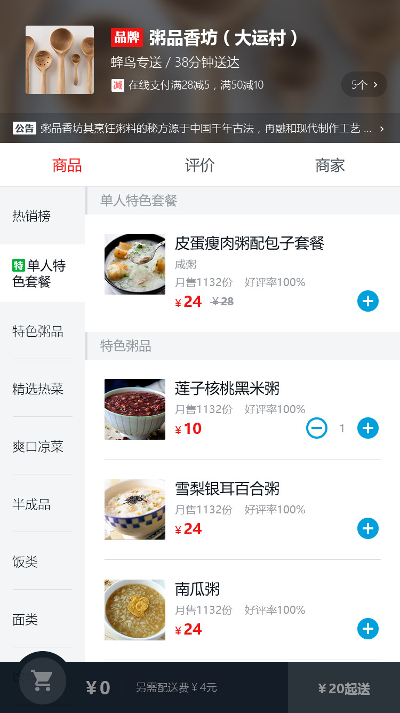
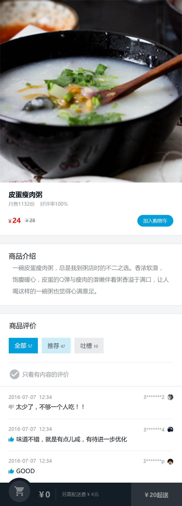
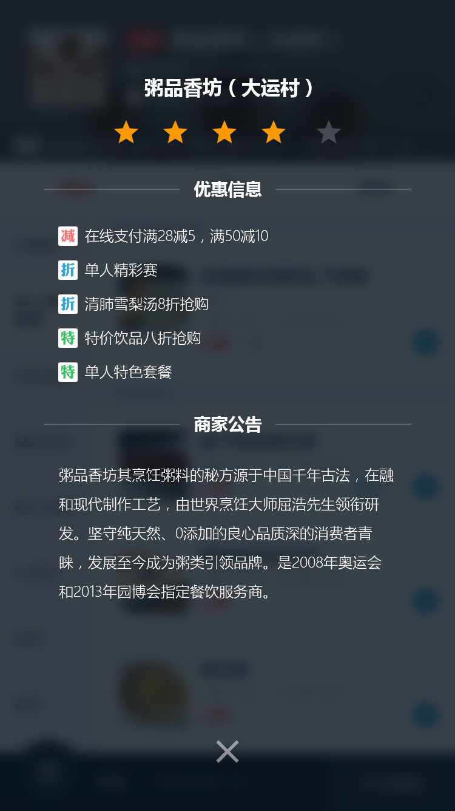

# vue/dingcang
这是一款基于vue2.0的订餐系统

# 目录树
```
├─build
├─config
├─resource
│  ├─img
│  ├─PSD
│  ├─SVG
│  └─标注
├─src
│  ├─common
│  │  └─fonts
│  └─components
│      ├─goods
│      ├─header
│      ├─seller
│      └─star
└─static
    └─css
```

# 运行教程
首先，列出来我们需要的东西：  
node.js环境（npm包管理器）
vue-cli 脚手架构建工具
cnpm  npm的淘宝镜像

从node.js官网下载并安装node，安装过程很简单，一路“下一步”就可以了（傻瓜式安装）。
 
安装完成之后，打开命令行工具，输入 node -v，如下图，如果出现相应的版本号，则说明安装成功。

npm包管理器，是集成在node中的，所以，直接输入 npm -v就会如下图所示，显示出npm的版本信息。

# 安装cnpm
在命令行中输入 npm install -g cnpm --registry=http://registry.npm.taobao.org 然后等待即可完成。

# 安装vue-cli脚手架构建工具
在命令行中运行命令 cnpm install -g vue-cli ，然后等待安装完成。(注意，这里使用cnpm来替代npm，不然速度超级慢，会导致卡在那)

# 安装项目所需的依赖
要安装依赖包，首先cd到项目文件夹（firstVue文件夹），然后运行命令 cnpm install ，等待安装。

# 运行项目
在项目目录中，运行命令 npm run dev ，会用热加载的方式运行我们的应用，热加载可以让我们在修改完代码后不用手动刷新浏览器就能实时看到修改后的效果。

### 运行结果





